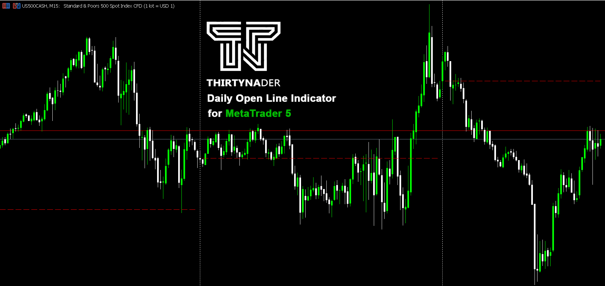
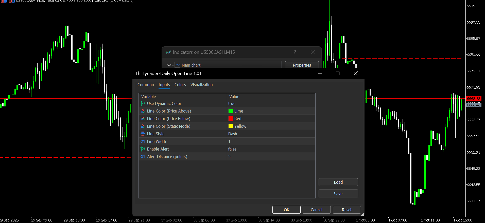

# Daily Open Line Indicator for MetaTrader 5

A professional and customizable indicator that displays the daily opening price level on your MT5 charts with dynamic color changes and alert functionality.

## 📊 Features

- **Accurate Daily Open Level**: Displays the exact opening price of each trading day
- **Dynamic Color System**: Line color changes based on current price position relative to daily open
- **Visual Line Break**: Clear visual separation between different trading days
- **Customizable Alert System**: Get notified when price approaches the daily open level
- **Fully Customizable Appearance**: Adjust colors, line style, and width to match your chart theme
- **Multi-Timeframe Support**: Works on any timeframe while tracking daily open levels
- **Lightweight & Efficient**: Minimal resource usage with optimized calculations

## 🎨 Visual Appearance

- **Green Line**: Price is trading above daily open (bullish)
- **Red Line**: Price is trading below daily open (bearish)
- **Yellow Line**: Static mode (when dynamic colors are disabled)
- **Dashed Style**: Default style with customizable options

## 🔧 Installation

1. Download the `Daily Open Line.mq5` file
2. Copy it to your MetaTrader 5 data folder: `MQL5/Indicators/`
3. Restart MetaTrader 5 or right-click on Navigator → Refresh
4. Find "Daily Open Line" in the Navigator under Indicators
5. Drag and drop onto your chart

## Download

➡️ [Download the Thirtynader Daily Open Line indicator (EX5 file)](https://github.com/Thirtynader/YourRepoName/raw/main/Thirtynader-DailyOpenLine.ex5)

## Screenshots

### Example on Chart

### Indicator Settings

## ⚙️ Input Parameters

| Parameter | Type | Default | Description |
|-----------|------|---------|-------------|
| **UseDynamicColor** | Boolean | true | Enable/disable dynamic color changes |
| **LineColorAbove** | Color | Lime | Line color when price is above daily open |
| **LineColorBelow** | Color | Red | Line color when price is below daily open |
| **LineColorStatic** | Color | Yellow | Line color in static mode |
| **LineStyle** | Enum | DASH | Line style (SOLID, DASH, DOT, etc.) |
| **LineWidth** | Integer | 1 | Line thickness (1-5) |
| **EnableAlert** | Boolean | false | Enable/disable price alerts |
| **AlertDistance** | Integer | 5 | Alert trigger distance in points |

## 📖 Usage Examples

### Day Trading
Monitor how price interacts with the daily open - a key support/resistance level for intraday traders.

### Breakout Trading
Watch for daily open breakouts with instant color changes to identify momentum shifts.

### Alert Trading
Enable alerts to get notified when price tests the daily open level without constantly watching charts.

## 🎯 Trading Concepts

The daily opening price is a significant psychological level in trading:
- Acts as dynamic support/resistance
- Helps identify intraday bias (bullish above, bearish below)
- Common reference point for institutional traders
- Useful for gap trading strategies

## 🔔 Alert System

When enabled, the indicator will:
- Trigger an alert when price comes within specified points of daily open
- Show the exact price level in the alert message
- Reset alerts for each new trading day
- Prevent duplicate alerts on the same day

## 🛠️ Technical Details

- **Platform**: MetaTrader 5
- **Type**: Chart Indicator
- **Buffer Count**: 1
- **Calculation Method**: Real-time on each tick
- **Version**: 1.01

## 📝 Changelog

### Version 1.01
- Fixed accurate daily open price calculation
- Improved buffer handling for precise levels
- Enhanced visual line breaks between days

### Version 1.00
- Initial release
- Basic daily open line functionality
- Dynamic color system
- Alert functionality

## 🤝 Contributing

Contributions, issues, and feature requests are welcome! Feel free to check the issues page.

## 💡 Tips

- Use on H1 or lower timeframes for best visual results
- Combine with other support/resistance indicators
- Enable alerts when trading multiple pairs
- Adjust line width for better visibility on different screen sizes

## ⚠️ Disclaimer

This indicator is for educational and informational purposes only. Trading involves risk, and past performance is not indicative of future results. Always use proper risk management.

## 📧 Support

If you find this indicator helpful, please give it a ⭐ star on GitHub!

---

**Happy Trading! 📈**
